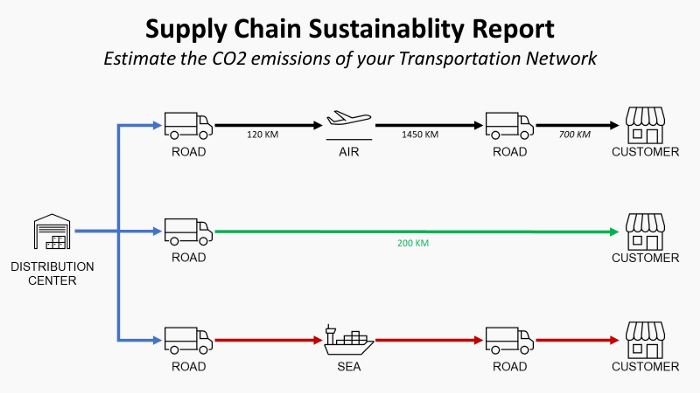

# Reporting Supply Chain Sustainability Using Machine Learning 🌲
*4 Steps to Develop ESG Reporting Focusing on Distribution Network CO2 Emissions*

  

Supply Chain Sustainability Reporting

The demand for transparent sustainable development from investors and customers has grown over the years.

Investors now place increased emphasis on a business's sustainability when evaluating its value and resilience.

Consequently, more organizations are investing resources in building capabilities for sustainability reporting and determining optimal strategies for sustainable supply chains.

### YouTube Video
Click on the GIF below to access a short explainer video explaining the concept behind this solution

  

## **Article**
In this [article](https://towardsdatascience.com/supply-chain-sustainability-reporting-with-python-161c1f63f267), we introduce a simple methodology for **reporting CO2 emissions from your Distribution Network** using **Python and PowerBI**.

## **Definition**
Based on the GHG Protocol corporate standard (Link), greenhouse gas emissions are classified into three scopes:

- Scope 1: Direct emissions released into the atmosphere due to the company’s activities (e.g., company facilities like manufacturing plants/warehouses, company vehicles).
- Scope 2: Indirect emissions from the generation of purchased energy (e.g., purchased electricity, gas).
- Scope 3: All other indirect emissions occurring in the company's value chain (e.g., transportation, waste operations, business travel).

This article focuses on Scope 3 calculations related to downstream transportation.
What is the environmental impact of your distribution network?

## **Formula**
Following the protocol of the French Environmental Agency Ademe (Link), the formula for estimating transportation CO2 emissions is:

  

Formula using Emission Factor

  where,
  E_CO2: emissions in kilograms of CO2 equivalent (kgCO2eq)
  W_goods: weight of the goods (ton)
  D: distance from your warehouse to the final destination (km)
  F_mode: emissions factor for each transportation mode (kgCO2eq/t.km)

This formula provides a gross estimation of CO2 emissions without requiring granular transportation data.
A more accurate approach would be to estimate CO2 emissions for each delivery, considering the vehicle model (e.g., truck, container carrier, plane, or train) and filling rate.

## **Objective**

1. Collect and process data to calculate emissions based on this formula.

  

Data to be Collected

2. Calculate unit of measure conversions considering shipped handling units.

  

Handling Units

3. Add distances by mode and compute CO2 emissions per order.

  

Emission by Transportation Mode

## **Examples of Visuals using PowerBI**

### Bubble map with size = f(CO2 Total)

  

Bubble Map

_Visual Insights_

Observe the locations with the majority of CO2 emissions (large bubbles) with color coding by transportation mode.

### Split by Country Destination and Item Code

  

Bar Chart

_Product Portfolio Insights_

Identify the items with the highest environmental impact in each market.

### CO2 = f(Turnover) by City Destination

  

Scatter Plot

_Financial Insights_

Assess the impact of future CO2 emission reduction efforts on profitability, particularly for customers in PEINE-WOLTORF.

# Code
This repository contains all the code used to explain the concepts presented in the article.
